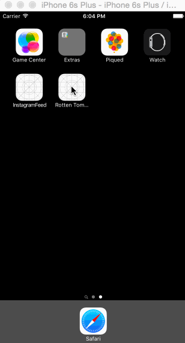

## Rotten Tomatoes

This is a movies app displaying box office and top rental DVDs using the [Rotten Tomatoes API](http://developer.rottentomatoes.com/docs/read/JSON).

Time spent: Around... 15 hours

### Features

#### Required

- [x] User can view a list of movies. Poster images load asynchronously.
- [x] User can view movie details by tapping on a cell.
- [x] User sees loading state while waiting for the API.
- [x] User sees error message when there is a network error
- [x] User can pull to refresh the movie list.

#### Optional

- [x] All images fade in. (though this has not been done specifically for when images are loaded via network)
- [x] For the larger poster, load the low-res first and switch to high-res when complete.
- [x] All images should be cached in memory and disk: AppDelegate has an instance of `NSURLCache` and `NSURLRequest` makes a request with `NSURLRequestReturnCacheDataElseLoad` cache policy. I tested this by turning off wifi and restarting the app.
- [x] Add a tab bar for Box Office and DVD.

### Walkthrough
The gif starts recording with wifi off.

Credits
---------
* [Rotten Tomatoes API](http://developer.rottentomatoes.com/docs/read/JSON)
* [AFNetworking](https://github.com/AFNetworking/AFNetworking)
* [MBProgressHUD](https://github.com/jdg/MBProgressHUD)